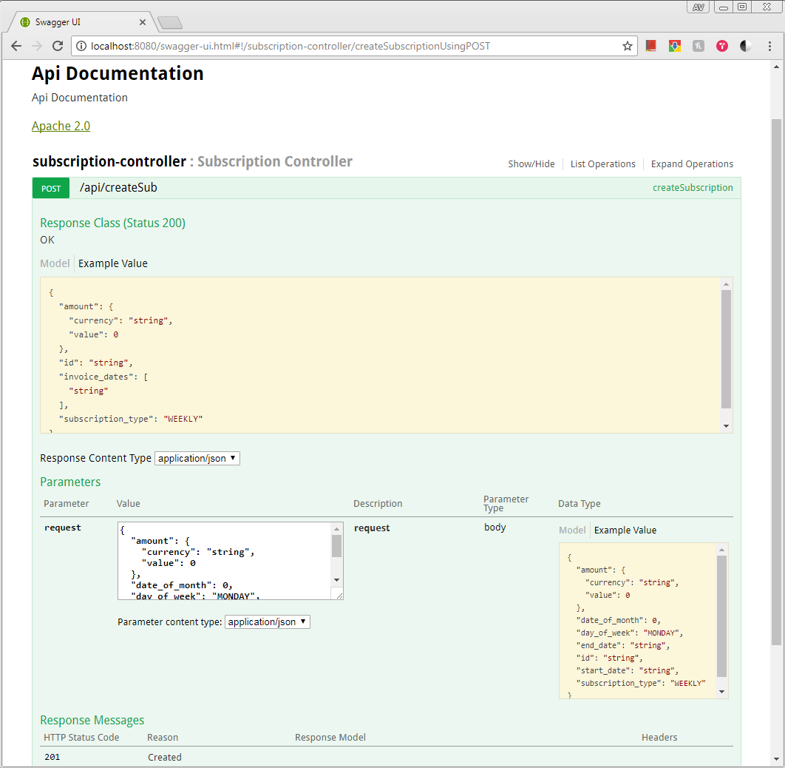

# Payment System

A spring boot based REST service for creating payment subscriptions and responding with invoice dates. Currently, backed by internal storage.

## Prerequisites

### Development

|Artifact|Description|Notes|
|---|---|---|
|Java JDK 1.8.0_131 or later|Used for compilation/running the application.|
|Intellij IDEA 2017|Recommended IDE.|Any other Java IDE or text editor can be used.|
|Maven 3|Used for building the application.|The version embedded inside of Intellij is fine, or a separate version can be installed from [Maven](https://maven.apache.org/download.cgi).|

### Production

|Artifact|Description|Notes|
|---|---|---|
|Java JDK 1.8.0_131 or later|Used running the application.|

## Build and acceptance testing
`mvn package`

## Starting the server

The server can be started directly from the JAR file:

`java -jar payment-system-<version>.jar`
 
 or maven starter can be used
 
 `mvn spring-boot:run`

The server will start on port `8080` by default.

## API documentation
The API is documented using Swagger V2.

http://localhost:8080/swagger-ui.html#!/subscription-controller/createSubscriptionUsingPOST

### Setting the Right Profile

Currently, it is the default profile. However, going foward we can use Dev, Prod and Persistence system specific profiles.

### Postman Collection
Once the application is up and running, following postman collection can be used to create subscription
[PostMan collection](https://www.getpostman.com/collections/7ca2f7b71ce166b53d1a)